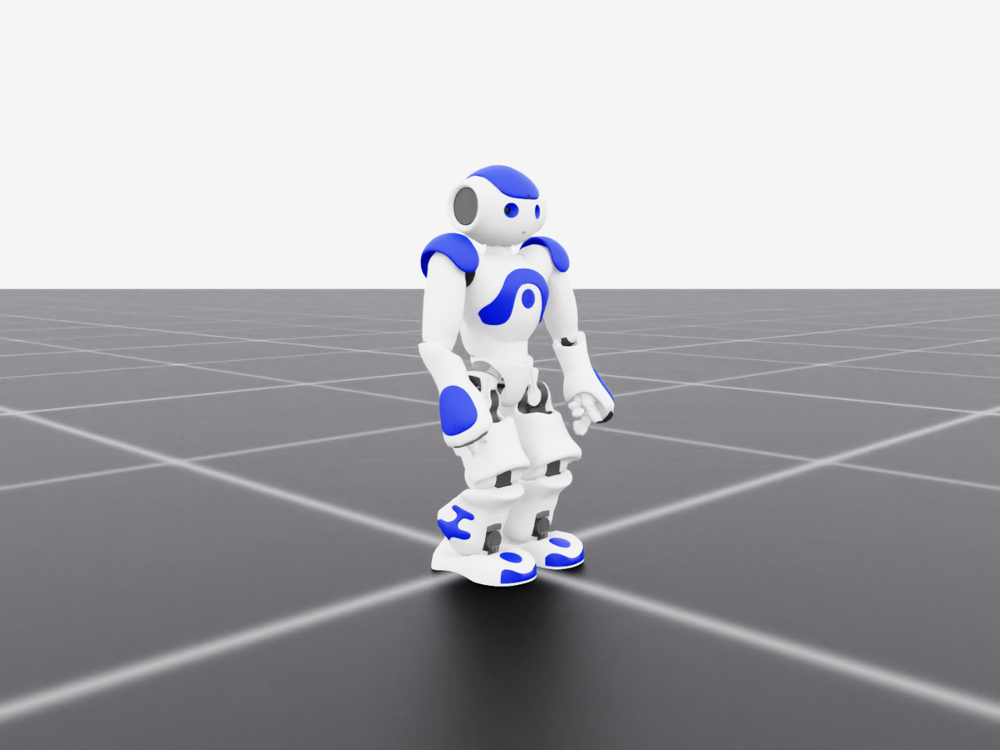

# Humanoid skill transfer

Isaac Lab research project on **cross-embodiment humanoid skill transfer**.

A skill is learned on a robot capable enough to learn it, and the research
question is what has to happen for that skill to end up on a robot that is not.

<p align="center">
  
</p>

---

## The three tracks

The repository is organised around the three parts of that question. Each is a
top-level folder with its own README, assets, documentation and scripts.

| Track | Robot | Role |
| --- | --- | --- |
| **[`nao/`](nao/)** | NAO H25 V5.0 — 5.3 kg, 0.58 m | **The target.** Limited for physical rather than algorithmic reasons, which is what makes the question a question. |
| **[`g1/`](g1/)** | Unitree G1 — 29 DOF, ~35 kg | **The source.** Capable enough to learn the skill in the first place. Its model already exists in Isaac Lab. |
| **[`transfer/`](transfer/)** | — | **The research.** What has to change for a skill to cross the gap between them. |

```text
.
├── nao/         ← target embodiment: assets, docs, scripts, results
├── g1/          ← source embodiment: docs, scripts
├── transfer/    ← the teaching process: plan, docs
├── source/      the installable Isaac Lab extension (all Python code)
├── scripts/     cross-track entry points: train, play, list_tasks
├── tests/       run without Isaac Sim
├── ARCHITECTURE.md
└── README.md
```

The Python code lives under `source/` because Isaac Lab requires that layout for
an external extension. It is split the same three ways internally — see
[ARCHITECTURE.md](ARCHITECTURE.md).

---

## Where the work stands

### Track 1 — the target robot: **done and measured**

Zero-step balance under perturbation, with a hard constraint: a foot that lifts
or slides more than 50 mm ends the episode. Without it the robot solves the task
by stepping, which is a different problem with different theory behind it.

Four controllers, one environment instance, n = 2048:

| Controller | Fall-free | 95 % CI | Ankle torque |
| --- | --- | --- | --- |
| **PPO policy** | **82.3 %** | [80.6, 84.0] | 44.0 % |
| PPO, arms frozen | 83.0 % | [81.4, 84.6] | 47.9 % |
| Joint PD | 77.6 % | [75.8, 79.4] | 34.3 % |
| Capture-point PD | 27.8 % | [25.9, 29.7] | 30.2 % |

| Contrast | Δ | z | Verdict |
| --- | --- | --- | --- |
| PPO − joint PD | +4.7 | 3.76 | **significant** |
| Arms frozen − PPO | +0.7 | 0.59 | not significant |

Established along the way, and reusable:

1. **Zero-step capturability is anisotropic by 1.87** on this robot — 0.443 m/s
   backward against 0.827 m/s toward the forward corners. Perturbation curricula
   have to be scaled by `ω₀·d(θ)`, not by an absolute speed.
2. **The inertia that sizes leg gains is the whole body about each joint axis**,
   larger by **543×** than the distal subtree at the ankle. Using the open-chain
   value is a three-order-of-magnitude error whose only symptom is falling over.
3. **PPO's entropy coefficient is not scale-free.** Adding the zero-step
   constraint cut the mean return from 116 to 25; the entropy bonus does not
   scale with the return, so buying entropy became more profitable than
   balancing. Action noise climbed 0.50 → 1.25 and performance decayed 61 % at
   *constant* difficulty, with no error anywhere.
4. **A penalty prices a behaviour; only a constraint removes it.** Soft foot
   penalties left 51 of 51 policies stepping.
5. **Sample size gates every claim.** At n = 128 the standard error near p = 0.85
   is 3.2 points, larger than any effect this task produces.

### Track 2 — the source robot: **teacher task ready**

`G1Walk-Teacher-v0`, built on Isaac Lab's `G1FlatEnvCfg`, with commands capped at
the Froude-matched speed (≈ 0.25 m/s, corresponding to 0.15 m/s on the NAO).
Not yet trained.

### Track 3 — the transfer: **scaffolding and a plan**

| Module | State |
| --- | --- |
| Joint correspondence | Done, tested. Records what the map *cannot* express. |
| Feasibility masking | Done, tested. Ignores the teacher where it asks for the impossible. |
| Student objective | Configuration only. |
| **Student walking task** | **Not started — the critical path.** |

Read [`transfer/README.md`](transfer/README.md) for the hypothesis and
[`transfer/docs/plan.md`](transfer/docs/plan.md) for the order of work and the
threats to the result.

### Open

- **Single seed.** The +4.7 margin characterises one policy, not the method.
- **The capture-point controller underperforms badly** (27.8 %) and the reason
  is not verified.
- **No hardware.** Everything is simulation.

---

## Setup

### 1. Isaac Lab

Install separately. Developed against a source checkout at `C:\IsaacLab`.

| Component | Version |
| --- | --- |
| Isaac Lab | 2.3.2 (`isaaclab` package 0.54.4) |
| Isaac Sim | 5.1.0 |
| rsl-rl-lib | 5.0.1 |
| PyTorch | 2.7.0+cu128 |
| Tested on | Windows 11, RTX 4070 Laptop |

### 2. This extension

```powershell
python -m pip install -e source\humanoid_transfer
```

### 3. NAO geometry, once

CC BY-NC-ND 4.0; upstream permits redistribution only through an installer that
obtains explicit assent, so **no mesh file is committed**:

```powershell
python nao\scripts\fetch_meshes.py
```

Prints the licence, requires you to type `I ACCEPT`, verifies SHA-256, extracts
with the standard library only. Native Windows, no WSL, no ROS.

### 4. Verify

```powershell
python -m pytest                                          # no Isaac Sim needed
python nao\scripts\view_asset.py --headless --max-steps 1
```

`view_asset.py` intentionally lets the robot collapse: that fall is what
validates the articulation, its collision geometry and gravity.

---

## Reproducing the balance results

```powershell
python nao\scripts\derive_gains.py
python nao\scripts\run_baseline.py --headless --controller joint_pd

python scripts\train.py --task NaoStand-Direct-v0 --headless `
    --num_envs 4096 --max_iterations 700 --seed 1 --run_name my_run

python scripts\play.py --task NaoStand-Direct-v0 --headless --num_envs 8 `
    --checkpoint logs\rsl_rl\nao_stand\<run>\model_699.pt

python nao\scripts\compare_controllers.py --headless --num-envs 2048 --steps 600 `
    --protocol directional --ablate-arms `
    --policy logs\rsl_rl\nao_stand\<run>\exported\policy.pt
```

Use `--num-envs 2048`. At 128 the binomial error swamps every effect this task
produces.

**Watch `Mean action std` during training.** It must flatten, not climb. See
finding 3 above.

---

## Licensing

This repository contains **no original NAO model**. Full provenance and the
licensing reasoning are in
[`nao/assets/licenses/README.md`](nao/assets/licenses/README.md).

| Component | Upstream | Commit | Licence |
| --- | --- | --- | --- |
| URDF (tracked, verbatim) | [ros-naoqi/nao_robot](https://github.com/ros-naoqi/nao_robot) | `6747646` | BSD 3-Clause |
| Meshes and texture (fetched, untracked) | [ros-naoqi/nao_meshes](https://github.com/ros-naoqi/nao_meshes) | `7c5b9f3` | CC BY-NC-ND 4.0 |

Meshes are never committed, and neither is the generated USD, which embeds them
and counts as Adapted Material. The top-level [`LICENSE`](LICENSE) covers only
this project's own code. **Non-commercial only.**
