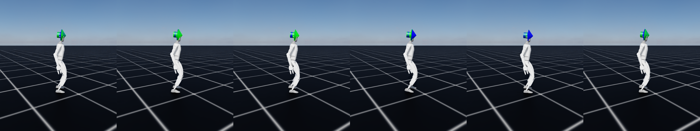

# How the teacher was trained

Everything about the walking policy this project uses as a teacher: where each
piece came from, which variables were chosen rather than inherited, and how the
result was verified.

<p align="center">
  
</p>
<p align="center">
  <sub>Six frames, 120 ms apart, of the trained policy at the Froude-matched
  command speed. Side view in the robot's own heading frame. Reproduce with
  <code>g1/scripts/render_gait.py</code>.</sub>
</p>

---

## 1. Provenance: what is borrowed and what is ours

The single most important thing to understand about this policy is what it is
**not**: it is not a pretrained model downloaded from anywhere. Isaac Lab ships
no weights for the G1 — a search of the entire checkout finds no `.pt` or
`.onnx` file for it. What Isaac Lab ships is a *recipe*, and the weights were
produced here by running it.

| Component | Source | Modified? |
| --- | --- | --- |
| Robot model (USD) | Isaac Lab Nucleus, `Robots/Unitree/G1/g1.usd` | No |
| Actuator groups and gains | `isaaclab_assets.robots.unitree:G1_29DOF_CFG` | No |
| Environment: rewards, observations, terminations, randomisation | `isaaclab_tasks…config.g1.flat_env_cfg:G1FlatEnvCfg` | Inherited; **one field changed** |
| PPO hyperparameters | `…config.g1.agents.rsl_rl_ppo_cfg:G1FlatPPORunnerCfg` | No |
| Command velocity range | — | **Ours. See §2.** |
| Trained weights | — | **Ours. Produced by the run in §3.** |

Nothing about making a 29-DOF humanoid walk is a contribution of this project.
It is a solved problem with a public, validated implementation, and reproducing
it from scratch would add risk without adding a result. The contribution this
repository is working toward is what happens *after* a teacher exists.

---

## 2. The one variable we chose

Exactly one field of the inherited configuration is overridden, and it needs
justification because it is the difference between a useful teacher and a
wasted run.

### The problem

The teacher exists to be imitated by a robot five times lighter and less than
half as tall. Isaac Lab's default command range samples forward and backward
speeds up to **1.0 m/s**, plus lateral and turning commands. None of that has a
counterpart on the student yet, and every episode spent there is experience the
transfer discards.

### The criterion

Two legged systems move in a dynamically similar way when their **Froude
numbers** match:

```
Fr = v² / (g · l)          ⟹          v_teacher = v_student · √(l_teacher / l_student)
```

The scaling goes with the **square root** of the length ratio, not the ratio.
That is the part that is easy to get wrong, and getting it wrong here would
matter: a linear rescaling gives 0.413 m/s, which is past the point where the
student's gait stops being recoverable between steps.

### The numbers

| Quantity | Value | Where it comes from |
| --- | --- | --- |
| Student CoM height, `l_student` | 0.2689 m | Derived from the NAO URDF |
| Teacher base height, `l_teacher` | 0.74 m | G1 spawn height |
| Scale factor `√(l_t/l_s)` | 1.66 | — |
| **Student target speed** | **0.15 m/s** | Chosen — see below |
| **Teacher command speed** | **0.249 m/s** | Computed from the above |

Why 0.15 m/s for the student? Its weakest zero-step capturable direction is
**0.443 m/s** (backward). A walking gait has to stay recoverable *between*
steps, not merely at the boundary, so the target is set at about a third of that
limit rather than approaching it.

### What was actually changed

```python
ranges.lin_vel_x = (0.0, FROUDE_MATCHED_SPEED)   # 0.0 … 0.249 m/s
ranges.lin_vel_y = (0.0, 0.0)                    # no lateral command
ranges.ang_vel_z = (0.0, 0.0)                    # no turning command
ranges.heading   = (0.0, 0.0)
```

Implemented in
[`g1_walk_env_cfg.py`](../source/humanoid_transfer/humanoid_transfer/g1/tasks/g1_walk/g1_walk_env_cfg.py).
The scaling itself lives in
[`common/scaling.py`](../source/humanoid_transfer/humanoid_transfer/common/scaling.py)
because it is a property of neither robot — it takes two lengths and returns a
ratio — and it is covered by `tests/test_g1_teacher.py`.

### The assumption this rests on

Froude matching is a **necessary** condition for dynamic similarity, not a
sufficient one. It says nothing about whether the NAO's actuators can deliver
the torques the scaled gait requires. Torque feasibility is a separate question
and is not addressed anywhere in this repository yet.

### Swapping the teacher

`SOURCE_ROBOT` in
[`g1/assets/g1.py`](../source/humanoid_transfer/humanoid_transfer/g1/assets/g1.py)
selects which shipped humanoid plays teacher: `g1_29dof` (default), `g1`
(23 DOF) or `h1` (19 DOF, matching the NAO's commanded joint count exactly).
Changing it changes the size of the embodiment gap, which is the variable the
transfer study most wants to vary.

---

## 3. The training run

```powershell
python scripts\train.py --task G1Walk-Teacher-v0 --headless `
    --num_envs 4096 --max_iterations 1500 --seed 1 --run_name teacher
```

| Setting | Value |
| --- | --- |
| Parallel environments | 4096 |
| Steps per environment per update | 24 |
| Samples per update | 98,304 |
| Iterations | 1500 |
| Total environment steps | 147.5 M |
| Control rate | 50 Hz |
| Wall-clock | **1 h 58 m** (7053 s) on an RTX 4070 Laptop |
| Seed | 1 |

### Learning curve

| Iteration | Mean reward | Episode length | Action std |
| --- | --- | --- | --- |
| 1 | −0.80 | 14.19 | 1.00 |
| 151 | 0.01 | 1000.00 | 0.92 |
| 301 | 26.15 | 1000.00 | 0.64 |
| 601 | 32.50 | 1000.00 | 0.50 |
| 901 | 34.40 | 1000.00 | 0.42 |
| 1201 | 33.91 | 995.45 | 0.43 |
| 1500 | 33.88 | 997.34 | 0.44 |

Episode length saturates at the 1000-step cap from roughly iteration 150 — the
robot stops falling early, and everything after that is refining *how* it walks.
Reward plateaus near 34 from about iteration 900.

### A note on the action standard deviation

It falls monotonically, 1.00 → 0.42, and then holds. That is worth recording
because it is the opposite of what the NAO balance task did before its entropy
coefficient was corrected, where it climbed 0.50 → 1.25 and never levelled off.

The mechanism is the same in both cases and the outcome differs only because of
one number. PPO's entropy bonus, `c_H · H`, has a magnitude independent of the
return. Here the return is ≈ 34 and the bonus is negligible against it, so the
optimiser tightens the policy. On the NAO with the zero-step constraint the
return was ≈ 25 with the same bonus scale, and buying entropy became the better
trade.

Same algorithm, same shipped hyperparameters, healthy behaviour — because the
task has a large return. That the G1 does this without any tuning is the
confirmation the NAO diagnosis was missing.

---

## 4. Verification

A reward curve does not show a walk. A policy that stands still, slides, or
steps in place can saturate episode length and track a velocity command well
enough to collect the same reward. Two checks separate those, and both are run
after training rather than assumed.

### Measured gait

`g1/scripts/measure_gait.py`, 32 environments, 8 s:

| Quantity | Value |
| --- | --- |
| Commanded forward velocity | +0.249 m/s |
| Achieved forward velocity (body frame) | **+0.206 m/s** |
| Fraction of command | 0.83 |
| Lateral drift | +0.004 m/s |
| Net displacement speed | 0.203 m/s |
| Foot clearance, left | 51.2 mm mean, 78.5 mm max |
| Foot clearance, right | 60.4 mm mean, 75.8 mm max |

**Verdict: walking.** It tracks 83 % of the commanded speed and lifts each foot
by 5–8 cm, which is a swing phase rather than contact jitter.

### A misreading worth recording

The first render appeared to show the robot drifting *backwards*, and the frame
log agreed: world-frame x went from −0.11 to −0.17 m.

It was walking forward the whole time. Initial yaw is randomised, so the world's
x axis is not the robot's forward direction. The body-frame measurement above is
the correct one; the world-frame position reading was measuring something else.

`render_gait.py` now places the camera in the robot's heading frame, so the
image cannot be misread the same way. The episode is left in this document
because it is the same failure this project has hit repeatedly: a plausible
number measuring a different quantity from the one it is named after.

---

## 5. Captured rollouts

```powershell
python g1\scripts\capture_rollouts.py --headless `
    --checkpoint logs\rsl_rl\g1_flat\<run>\exported\policy.pt
```

| Property | Value |
| --- | --- |
| Shape | 400 steps × 32 environments |
| Control rate | 50 Hz |
| Joints recorded | 37 |
| Feet tracked | `left_ankle_roll_link`, `right_ankle_roll_link` |
| Achieved mean speed | 0.216 m/s |
| Size | 4.6 MB |

Two design decisions:

- **All three candidate teacher signals are recorded together** — joint states
  with their names, centroidal position, velocity and angular momentum, and
  per-foot normal force. Deciding later which to use is free; re-running the
  capture costs a GPU hour.
- **Everything is stored in the teacher's own units.** Scaling to the student is
  the transfer package's job. Doing it at capture time would bake in one answer
  to the question the study is asking.

Archives are untracked (`g1/rollouts/` is gitignored): regenerable from a
checkpoint, and derived from trained weights rather than authored here.

### An open discrepancy

The loaded articulation reports **37 joints**, while `G1_29DOF_CFG` and this
project's own `describe_source_robot()` say 29. The extra joints are most likely
hands or wrists present in the USD but outside the 29-DOF control set. This has
not been reconciled, and until it is, the joint-level correspondence map should
be treated as covering a subset of what the capture contains rather than all of
it. The centroidal and contact signals are unaffected.

---

## 6. Reproducing this

```powershell
# 1. Validate before spending the GPU hours
python g1\scripts\check_env.py --headless

# 2. Train
python scripts\train.py --task G1Walk-Teacher-v0 --headless `
    --num_envs 4096 --max_iterations 1500 --seed 1 --run_name teacher

# 3. Export TorchScript
python scripts\play.py --task G1Walk-Teacher-Play-v0 --headless --num_envs 8 `
    --checkpoint logs\rsl_rl\g1_flat\<run>\model_1499.pt

# 4. Verify it walks, rather than assuming
python g1\scripts\measure_gait.py --headless `
    --checkpoint logs\rsl_rl\g1_flat\<run>\exported\policy.pt

# 5. Look at it
python g1\scripts\render_gait.py `
    --checkpoint logs\rsl_rl\g1_flat\<run>\exported\policy.pt

# 6. Record the behaviour for the transfer study
python g1\scripts\capture_rollouts.py --headless `
    --checkpoint logs\rsl_rl\g1_flat\<run>\exported\policy.pt
```

The G1 USD downloads from Isaac Lab's Nucleus server on first use, so step 1
needs network access.

`render_gait.py` runs **with a window**. Offscreen capture crashes in
`rtx.scenedb` during Hydra engine creation on this hybrid-graphics machine; the
other steps are headless and unaffected.

---

## 7. What this does not establish

- **One seed.** No claim is made about variance across training runs.
- **One speed.** The teacher walks at a single commanded velocity, which is what
  the transfer study needs first and is not a general gait controller.
- **Simulation only.** No hardware, and no actuator model measured from one.
- **Nothing about transfer.** A teacher that walks is the input to the research
  question, not an answer to it. See [`../transfer/README.md`](../transfer/README.md).
